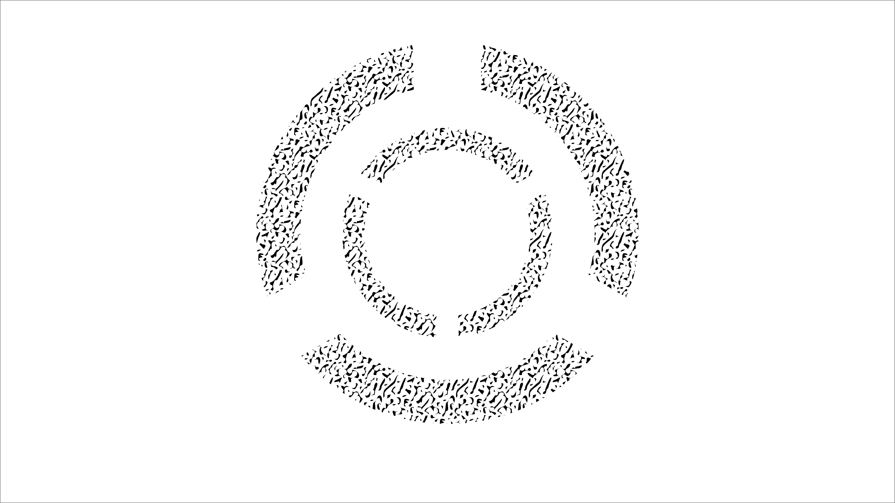
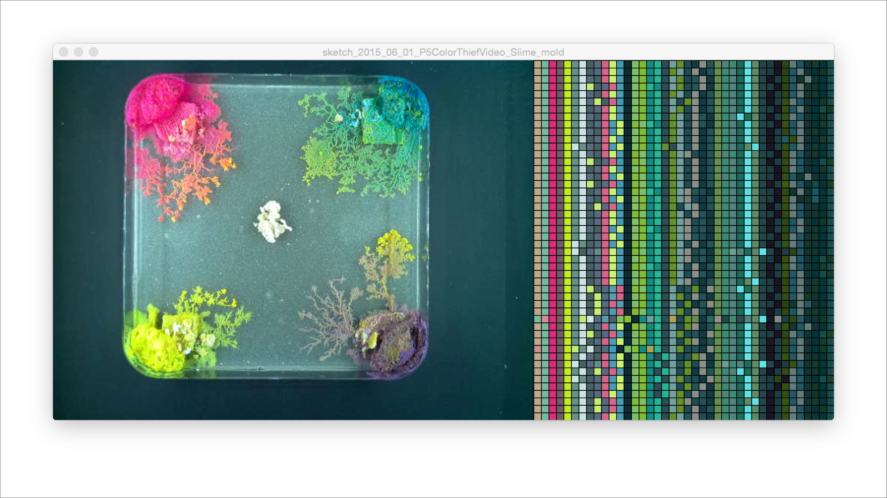

README   
======

> "I collect spores, molds, and fungus."  
> [Dr. Egon Spengler, when asked about his hobbies](https://www.youtube.com/watch?v=ZeWgnPeZES8)

## Abstract of the slime mold project  

With this documentation I would like to present the results of our slime mold project developed during the summer term at FHP tutored by Fabian Morón Zirfas: 11EG-B Elementares Gestalten - Basics 1.012 Grundlagen Fläche und Struktur
Werkstattpraxis. [Link website](https://incom.org/workspace/5859)

## Prerequisite  

The initial information about our new project was a TED talk our teacher showed us (see link below). As a result of our project we had to create a time lapse video of a growing mold, analyze it via OpenCv and generate a visual output.

We learned that slime molds, or physarum polycephalum, shows some kind of low level intelligent behavior by connecting different feeding grounds through the shortest distance with his own body. Once placed in an area he starts to grow quickly searching for food. He likes oat the most, prefers dark places to live and rises about one cm an hour under best conditions. At first we were given some offshot of a living physarum polycephalum by our teacher.

#### The first challenge was to:

- nurse our mold (prevent him of starving),
- give him a name,   
- and devise a complex experiment

I named my organism after special agent Fox Molder one of the main characters of the x-files series. Cunning as a fox, physarum polycephalum, searches his ground for food looking for intelligent solutions.

I had a lot of ideas but primarily I was interested if Fox Moulder is somehow adaptive and able to learn. So I sketched out my first experiments. Here are the first approaches

#### Visualise movement with uv light by adding fluorescent pigments to his food

#### How hard is special agent Fox Moulder?

#### Is he abel to smell the food ground?

#### Is Fox able to learn and somehow adaptive?

Another idea was that it might be possible to let him grow in specific shape, pattern or direction by influencing his culture medium. So I came up with the idea to carve the culture medium with a scalpel to let him grow in a specific shape, e.g his name or in a straight line towards his feeding ground.

Due to the annoying fact that carving the culture medium was visible I was wondering if Fox Moulder likes or dislikes certain fluids or substances, e.g. disinfectant spray in order to let him grow in a specific direction or shape. The idea was to create a paper stencil and spray the culture medium to let him grow in certain boundaries.   

#### Make a decision

At first glance I was fascinated by the idea that Fox Moulder is somehow able to anticipate or to learn where he gets food, when changing the feeding ground. But after a second look it became clear to me that these experiments might be to complex and could easily fail.

So after an intensive web study for more inspiration I started to concentrate on the first experiment. Feeding Fox moulder with fluorescent pigments added to his porridge to visualize his directed movement by letting him glow under uv light. Another question was: What will happen when two different colored mould branches meet each other? Will they mix their color into a new one? And how will the spray work to let him grow in specific boundaries?

#### Set up the Raspberry Pi

In order to create the time lapse we had to use the Raspberry Pi 2 microcomputer with a camera attached. Unfortunately the Raspberry Pi camera had a fixed focus lens (By the way here is a tutorial which explains how to loosen the lens to change the focus: [Raspberry Pi camera hack](https://www.youtube.com/watch?v=u6VhRVH3Z6Y). So searching for a box with the fitting dimension (width, especially height and depth) was the first step to get the right distance for the Raspberry Pi camera. I decided to make a box on my own to have the best focal distance. Here is a picture of my recording device called the Fox Lab.

Inside the box I attached two uv LED stripes on each side to illuminate the scene. The following picture shows the Raspberry Pi2 setup with the camera and the LED stripes attached on a relay to control the illumination time.    

#### First experimental preparation

Before I started to transfer my first experiment I tried to see if Fox Moulder is generally able to absorb the pigment colored food . So I gave him a large portion of a magenta colored porridge mix. I was totally happy to see that even under the uv light he showed the desired results.     

#### Possible visual output

Meanwhile I made some sketches for the visual output we were asked for

  

Finally I prepared the the first disinfectant sprayed petri dish and captured him under the uv light. But unfortunately the mold did not behave the way he did in the forerun. Maybe the mold was too weak or too undersized. Another fact was that the spray also did not seems to work properly.    

So I started to set up another experiment, where I used square black colored aga-aga cubes instead of spray to let him grow in a checkerboard pattern. After a few days and several photos I realized that this is not going to work. The mold did not want spread. Maybe he did not like the self made black colored culture medium or maybe the uv light I used to light up the scene was unsuitable.         

#### Final experiment: No uv light, no boundaries.

Time was slipping away. So instead of uv-light I used white LED light for the final experiment and placed four big branches with colored porridge in each corner of a square petri dish.

After the first day of taking photos it became obvious that the mold seemed to be pleased with his new conditions and finally started to spread, searching for food.

_Fox Molder finally glows in the dark_

Everything turned out the way I wanted to be, except the fact that the culture medium started to dry out and Fox started to going mouldy after five days of recording. Therefore I wasn´t able to answer the question: what will happen when the branches withe their different colors clashes.

#### Video of the final time lapse

_Password: Fox_

Thinking of a visual output was the next challenge. I already had some ideas and sketches which I did some days before (see above). But they didn´t fit to my experimental color based results anymore. So I decided to create a visual output that includes the colors I had in my results. To extract the dominant colors of each frame was the main goal I wanted to achieve and finally create something like this. [Frederic Brodbeck](http://cinemetrics.fredericbrodbeck.de/)

## Dependencies  

1. Python for recording script.
2. Python for crontab.
3. Processing + Java for ColorThief (tracking script).

Primarily we used python for the recording script. Depending on the time settings in the cronjob it creates jpg pictures and stores it in an image folder. Additionally I changed the recording setup for the Pi camera to get the best picture results for low light conditions :

#### Capturing in low light description and code

[Raspberry Pi camera in low light description](http://picamera.readthedocs.org/en/latest/recipes1.html#capturing-in-low-light)

    GPIO.output(11,GPIO.HIGH)
    # Set a framerate of 1/6fps, then set shutter
    # speed to 6s and ISO to 800
    cam.framerate = Fraction(1, 1)
    cam.shutter_speed = 1000000           
    cam.exposure_mode = 'off'             
    cam.iso = 100                     
    cam.awb_mode = 'off'                
    cam.awb_gains = 1.7             
    # Give the camera a good long time to measure AWB
    # (you may wish to use fixed AWB instead)
    # time.sleep(10)

#### Camera controller Long time exposure script.

    """
    camera controller for tracking slime molds
    University of Applied Sciences Potsdam (Germany) @idpotsdam
    author: fabiantheblind
    license: MIT
    """

    import sys # we need this to exit if the GPIO lib is not present
    import time # just for testing purpose
    import datetime # for timestamps
    import os # for path checking

    ###########################

    from fractions import Fraction

    ###########################

    # change these if you like
    IMAGEFOLDER = "/home/pi/fhp/images/"
    IMAGENAME = "slime"

    # leave this alone
    TIMESTAMP = 0
    # Check if the libraries exist on this system
    # if not throw a warning
    try:
    import RPi.GPIO as GPIO
    print "GPIO lib is present. Moving on"
    except ImportError:
    print "GPIO lib is not installed. Stopping program"
    print "Please install it with the commands:"
    print "$ sudo apt-get update"
    print "$ sudo apt-get install rpi.gpio"
    sys.exit()
    try:
    import picamera
    print "picamera lib present moving on"
    except ImportError:
    print "picamera lib is not installed. Stopping program"
    print "Please install it with the commands:"
    print "$ sudo apt-get update"
    print "$ sudo apt-get install python-picamera python3-picamera"
    sys.exit()

    def lighton(led1):
    GPIO.output(led1, GPIO.HIGH)

    def lightoff(led1):
    GPIO.output(led1, GPIO.LOW)

    ##
    #Add more LEDs as arguments
    #
    def setup(led1):
    """Setup all that stuff"""
    print "setup GPIO"
    global TIMESTAMP
    GPIO.setwarnings(True)
    GPIO.setmode(GPIO.BOARD)
    GPIO.setup(led1, GPIO.OUT)
    if not os.path.exists(IMAGEFOLDER):
        print "folder does not exists. Create it"
        os.makedirs(IMAGEFOLDER)
    ts = time.time()
    TIMESTAMP = datetime.datetime.fromtimestamp(ts).strftime("%Y-%m-%d %H-%M-%S")

    # now run all of that
    if __name__ == '__main__':
    try:
        setup(11)
        print "GPIO all set up"
        cam = picamera.PiCamera()
        # this is just for testing
        # the max resolution is
        # 2592 x 1944
        cam.resolution = (2592, 1944)

    ###################

    GPIO.output(11,GPIO.HIGH)
    # Set a framerate of 1/6fps, then set shutter
      # speed to 6s and ISO to 800
      cam.framerate = Fraction(1, 1)
      cam.shutter_speed = 1000000 			
      cam.exposure_mode = 'off' 			
      cam.iso = 100 					
    cam.awb_mode = 'off'				
    cam.awb_gains = 1.7				
    # Give the camera a good long time to measure AWB
      # (you may wish to use fixed AWB instead) #time.sleep(10)

    ###################

        filename = IMAGEFOLDER + IMAGENAME + TIMESTAMP + ".jpg"

    cam.capture(filename)
    GPIO.output(11,GPIO.LOW)
    print "image_out"

        print "made a picture and wrote it to ", filename
        cam.close() # close the cam again

    except KeyboardInterrupt:
    # here you put any code you want to run before the program
    # exits when you press CTRL+C
        print "KeyboardInterrupt"
        GPIO.cleanup() # this ensures a clean exit
    # except:
    # this catches ALL other exceptions including errors.
    # You won't get any error messages for debugging
    # so only use it once your code is working
        # print "Other error or exception occurred!"
    finally:
        print "end. clean up GPIO"
        GPIO.cleanup() # this ensures a clean exit

#### Final step. Tracking the mold

Instead of using OpenCV I accomplished the final task with a script by Fabian Moron Zirfas. A script, written in Java named P5ColorThief, that extracts the dominant colors of each frame of the video and displays it to the screen.

      <!---
    /**
     * Simple sketch that shows how to grap colors from a short video
     * @author: Fabian Morón Zirfas
     *
     */
    // import the needed libraries
    import processing.video.*;
    import me.fabianmoronzirfas.colorthief.*;

    P5ColorThief thief; // our thief object
    Movie video;  // will hold the video
    int x = 640; // this is for displaying the palette
    int y = 0; // same thing here

    /**
    int diameter = 150;
    int[] angs = {30, 10, 45, 35, 60, 38, 75, 67};
    float lastAng = 0;
    **/

    void setup() {
      video = new Movie(this, "2015_06_02_timelapse_640x480.mov");// load the video
      thief = new P5ColorThief(this);// enter "THE THIEF"
      size(1040, 480); // 2 times the size of the video
      //video.loop(); // loop it
      video.play(); // play it
      // reduce the speed so it is better to see whats going on
      frameRate(30);

    }
    void draw() {
      image(video, 0, 0); // display the video
      PImage frame = video.get(); // grap the latest frame
      // extract the palette
      color [] palette = thief.getPalette(frame, 41);
      float r = red(palette[0]);
      float g = green(palette[0]);
      float b = blue(palette[0]);
      println(r,g,b);//displays RGB values in console

      // loop the palette
      // and create some rectangles from its colors
      for (int i = 0; i < palette.length; i++) {
        fill(palette[i]);
        rect(x, y, 10, 10);
        x+=10;
        // constrain it to the screen
        if (x == width) {
          y+=10;
          x=640;

        } // end if width
        if (y == height) {
          y = 0;
        } // end if height
      }// end loop

    /**
    for (int i = 0; i < angs.length; i++){
      fill(palette[i]);
      arc(75, 75, diameter, diameter, lastAng, lastAng+radians(angs[i]));
      lastAng += radians(angs[i]);  
    }
    **/

    } // end draw
    // needed to grap the video
    void movieEvent(Movie m) {
      m.read();
    }
    -->

Here is a screenshot of the running script:

## Install the camera recording script   

To install the recording script just clone the GitHub file or click the link below.

[Link to the camera recording script](https://github.com/back280/IO-SoSe-2015-fox-moulder/blob/master/code/recording_script/camera_controller_long_ex.py)

Save the code to your Raspberry Pi in a folder named e.g. python. Create an image folder called images on the same level where you created the python folder and get a cronjob run.

#### Crontab job

To create a crontab job on the Raspberry Pi, we used the terminal interface. Open the crontab tool by typing:

    sudo crontab -e

and create a path to your script you want to run repeatedly.

    * * * * * /usr/bin/python /home/pi/fhp/slime_mold_recording_setup/python/camera-controller_long_ex.py  

Once you set up the cronjob, the Raspberry Pi will execute the recording script every minute.

#### P5ColorThief library

To run the script download the P5ColorThief library from this source and install the library in Processing:

[Link P5ColorThief library ](https://github.com/fabiantheblind/P5ColorThief)

#### P5ColorThief tracking script

Download the following tracking code and the data folder and store it anywhere on you computer:

[Link P5ColorThief tracking code ](https://github.com/back280/IO-SoSe-2015-fox-moulder/tree/master/code/P5ColorThiefVIdeo/sketch_2015_06_01_P5ColorThiefVideo_Slime_mold)

## Usage  

Now open the code in Processing and just run the script. Make sure you have a fitting video in your data folder.  

## Realted Works  

Here are my latest projects.

- [Algorythm project](https://github.com/back280/IO-SoSe-2015-algorythm)  

- [Flip Board](https://github.com/back280/IO-SoSe-2015-flip-board)

## Thanks  

I want to thank Fabian Morón Zirfas for all the support.

## License  

    DO WHAT THE FUCK YOU WANT TO PUBLIC LICENSE
    Version 2, December 2004

    Copyright (C) 2015 Paul Roemer

    Everyone is permitted to copy and distribute verbatim or modified
    copies of this license document, and changing it is allowed as long
    as the name is changed.

    DO WHAT THE FUCK YOU WANT TO PUBLIC LICENSE
    TERMS AND CONDITIONS FOR COPYING, DISTRIBUTION AND MODIFICATION

    0. You just DO WHAT THE FUCK YOU WANT TO.
